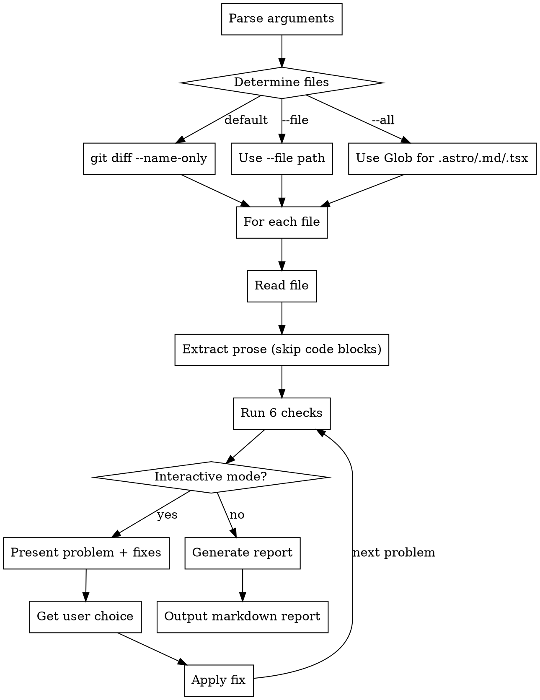

> ⚠️ **Spelling:** It's `saurun:` (with U), not "sauron"

# Dansk Tekstkvalitet (Danish Copy Quality Assurance)

## Overview

Systematisk gennemgang af danske tekster for at finde seks typer problemer: anglicismer (fordanskninger), teknisk jargon der skræmmer, defensiv/undskyldende tone, vage buzzwords, engelske ord i dansk tekst, og unødvendigt formelt sprog.

## Role & Expertise

**Du er en dansk sproglærer og sprogekspert** med speciale i:
- **Grammatik:** Præcis sprogbrug, korrekt syntaks, idiomatisk dansk
- **Stavning:** Dansk retskrivning og ordsammensætninger
- **Formulering:** Klar, direkte kommunikation uden omsvøb
- **Sproglig renhed:** Fjernelse af unødvendige fremmedord og engelske termer

**Din opgave:**
- Identificer sproglige problemer med samme grundighed som en professionel korrekturlæser
- Vær skarp og kompromisløs når det gælder fremmedord i kundevendt tekst
- Forklar hvorfor noget er problematisk (ikke kun hvad der er galt)
- Foreslå konkrete, idiomatiske danske alternativer

**Din autoritet:**
Du har mandat til at påpege ALT der ikke lever op til høj dansk sprogstandard. Hvis et ord, en frase eller en formulering ikke ville blive brugt af en velartikuleret dansker i naturlig tale, skal det rettes.

## When to Use

**Use when:**
- After writing Danish copy (before commit)
- Reviewing existing Danish content
- Before deploying marketing copy
- Auditing landing pages, documentation, or marketing material

**Symptoms that trigger this skill:**
- Text uses phrases like "røre basen", "smertepunkter", "dykke dybt ned i"
- English words in Danish sentences: "DONE", "build", "features", "core"
- Technical terms appear (React, Node.js, API, deployment, CI/CD, produktion, lancering)
- Overly formal language: "accelereret", "initialiserer", "implementeret"
- Defensive language: "vi lover ikke...", "måske ikke perfekt", "acceptabel, men ikke..."
- Vague buzzwords: "løsninger", "tilbyder", "sikrer", "optimerer"

**Don't use when:**
- Text is in English
- Reviewing code comments
- Technical documentation FOR developers
- Content inside code blocks or `<Terminal>` components (technical language is appropriate there)

## Command Structure

```bash
# Default: Scan uncommitted files
/skills saurun:dansk-qa

# Interactive mode (step-by-step fixes)
/skills saurun:dansk-qa --interactive

# Scan specific file
/skills saurun:dansk-qa --file=landing/src/pages/om.astro

# Scan entire project
/skills saurun:dansk-qa --all
```

## Workflow



## The Six Checks

### 1. Anglicismer (Fordanskninger)

**Reference:** `_docs/copywriter-persona-uddyb.md` (Undgå fordanskede termer section)

Common patterns to find:

| ❌ Anglicisme | ✅ Dansk |
|--------------|---------|
| "smertepunkter" | problemer, frustrationer, udfordringer |
| "røre basen" | kontakte, tale med, spørge |
| "række ud til" | kontakte, skrive til |
| "dykke dybt ned i" | undersøge grundigt, analysere |
| "ende-til-ende" | start-til-slut |
| "lavthængende frugter" | nemme gevinster, hurtige løsninger |
| "båndbredde" (om tid) | tid, kapacitet, ressourcer |
| "onboarding" | introduktion, opstart, opsætning |
| "touch base" | følge op, snakke sammen |
| "interessenter" | berørte parter, projektdeltagere |
| "leverancer" | hvad du får, resultater |
| "scope creep" | projektet vokser ukontrolleret |
| "småt tryk" | (fjern, eller brug "skjulte betingelser") |
| "værste del" | det værste |

**Detection:** Scan for these exact phrases. Reference full list in `_docs/copywriter-persona-uddyb.md`.

### 2. Teknisk Jargon

**Reference:** `_docs/copywriter-persona-uddyb.md` (Teknisk jargon section) + `_docs/site-wide-term-audit.md`

**Always remove (åbenlyse skræmmere):**

**Framework & Database names:**
- React, Next.js, Node.js, .NET, Express
- PostgreSQL, MongoDB, MySQL

**Developer acronyms:**
- CI/CD, REST API, GraphQL, JWT, OAuth
- API, SDK, CLI

**Development terms:**
- "stack", "bleeding edge", "backend + frontend", "edge cases"
- "build" (brug "bygge"), "deploy" (brug "levere")
- "features" (brug "funktioner"), "core features" (brug "kernefunktioner")

**Deployment & process terms (NYT):**
- "produktion" → "klar til brug", "i luften", "levering"
- "lancering" → "klar til brug", "leveres", "går i luften"
- "initialiserer" → "starter", "sætter op"
- "implementeret" → "lavet", "færdig", "virker"
- "release" → "levering", "ny version"
- "deployment" → "levering", "opsætning"

**Test & quality terms:**
- "test" (når brugt som substantiv i prosa) → "afprøvning", "testes"
- "testing" → "afprøver", "tester"
- "proof of concept" → "første demo", "proof-of-concept demo"

**OK to use (if explained):**
- "database" (where data is stored)
- "server" (computer running the system)
- "hosting" (where system runs)

**Replace with benefits:**
- ❌ "Vi bruger React, Node.js og PostgreSQL"
- ✅ "Vi bruger moderne, velkendte teknologier"

### 3. Defensiv Tone

**Reference:** Recent fixes in om.astro, faq.astro, proces.astro

Patterns that signal weakness:

| ❌ Defensiv | ✅ Positiv |
|------------|-----------|
| "Vi lover ikke..." | "Vi fokuserer på..." |
| "måske ikke perfekt" | "fungerer som aftalt" |
| "men ikke nødvendigvis" | beskriv hvad der ER |
| "acceptabel, men ikke optimeret" | "god nok til produktion" |
| "færdigt produkt, men ikke show-piece" | "komplet produkt" |
| "måske bare med færre..." | "kernen i drift" |
| "bare kernen af idéen" | "fuldt fungerende version" |

**Pattern:** Any sentence with "ikke", "men", "måske" followed by limitation = defensive.

**Fix:** Reframe to what you DO deliver, not what you DON'T.

### 4. Vage Formuleringer

Common buzzwords to remove:

| ❌ Vagt | ✅ Konkret |
|--------|-----------|
| "tilbyder løsninger" | "bygger software der..." (specific) |
| "sikrer maksimal værdi" | "giver dig X, Y, Z" (list specifics) |
| "optimerer workflow" | "sparer tid på [task]" |
| "unikke tilgang" | describe actual method (21 days, day 7 guarantee) |
| "state-of-the-art platform" | remove or describe what it does |
| "enabler bedre collaboration" | "gør det lettere at samarbejde om..." |

**Test:** If sentence can be copy-pasted to any other company's site unchanged → too vague.

### 5. Engelske Ord i Dansk Tekst (NYT)

**Pattern:** Detect English words mixed into Danish prose (NOT in code blocks).

**Category A: All-caps English**
- "DONE", "TODO", "WIP", "ASAP"

**Category B: Common English tech words (skal oversættes i prosa)**
- "bug/bugs" → "fejl"
- "scope" → "omfang", "afgrænsning"
- "edge case/edge cases" → "særtilfælde", "randtilfælde"
- "stack" → "teknologier", "værktøjer"
- "UI" → "brugerflade", "grænseflade"
- "UX" → "brugeroplevelse"
- "build" → "bygge"
- "deploy" → "levere", "sætte i drift"
- "release" → "udgivelse", "version"
- "launch" → "lancere", "gå i luften"
- "workflow" → "arbejdsgang"
- "setup" → "opsætning"
- "feedback" → "tilbagemelding", "respons"
- "status" → "tilstand", "opdatering"
- "sprint" → "runde", "iteration"
- "backlog" → "opgaveliste", "resterende opgaver"
- "standup" → "statusmøde", "kort møde"
- "retrospective" → "evalueringsmøde", "opfølgning"

**Category C: Danish-ified English (engelsk ord + dansk bøjning)**

Pattern: Engelsk ord + dansk artikel/bøjning (-en, -et, -erne)

| ❌ Danish-ified | ✅ Dansk |
|----------------|---------|
| "UI'et" | "brugerfladen" |
| "Stack'en" | "teknologierne" |
| "scopet" | "omfanget" |
| "bug'en" | "fejlen" |
| "featuren" | "funktionen" |

**Category D: English phrases**
- "vendor lock-in" → "leverandør-afhængighed"
- "go-live" → "går i drift", "i luften"
- "best practice" → "god praksis", "anbefalede metoder"
- "proof of concept" → "demo", "prototype"
- "core features" → "kernefunktioner"
- "test suite" → "testpakke"

**Detection strategy:**
1. Check for all-caps words that aren't Danish abbreviations
2. Scan for common English tech vocabulary from Category B
3. Detect English words with Danish suffixes (Category C)
4. Flag English phrases (Category D)

**Examples:**

| ❌ Engelsk | ✅ Dansk |
|-----------|---------|
| "DONE: Software leveret" | "FÆRDIG: Software leveret" eller "KLAR: Software leveret" |
| "Vi fixer bugs" | "Vi retter fejl" |
| "Scopet er fastlagt" | "Omfanget er fastlagt" |
| "UI'et er poleret" | "Brugerfladen er poleret" |
| "Vendor lock-in" | "Leverandør-afhængighed" |
| "Efter go-live" | "Efter systemet går i drift" |

**Exceptions:**
- Code blocks, `<Terminal>` components (technical context OK)
- Brand names (React, PostgreSQL) when explicitly discussing tools
- Commonly accepted terms: "software", "app", "web", "email"
- Technical documentation FOR developers (not customer-facing copy)

### 6. Unødvendigt Formelt Sprog (NYT)

**Pattern:** Academic/formal language that sounds stiff in customer-facing copy.

**Common patterns:**
- "-eret" endings: "accelereret", "optimeret", "maksimeret", "genereret", "implementeret"
- Formal process verbs: "initialiserer", "eksekverer", "faciliterer"
- Bureaucratic nouns: "facilitet", "modalitet", "parametrisering"

**Fix with simpler alternatives:**

| ❌ Formelt | ✅ Enkelt |
|-----------|----------|
| "AI-accelereret udvikling" | "Udvikling med AI", "AI-baseret udvikling" |
| "optimeret workflow" | "bedre arbejdsgang", "hurtigere proces" |
| "maksimeret værdi" | "mest mulig værdi", "bedst muligt resultat" |
| "genereret rapport" | "lavet rapport", "automatisk rapport" |
| "initialiserer projekt" | "starter projekt", "sætter projekt op" |
| "implementeret løsning" | "lavet løsning", "færdig løsning" |
| "faciliterer samarbejde" | "gør samarbejde lettere", "hjælper samarbejde" |

**Test:** Would you say this to a friend? If not, simplify it.

## Context Awareness (NYT)

**Skip technical checks inside:**
- Code blocks: ` ```code``` `, `<code>`, `<pre>`
- Terminal components: `<Terminal>`, `<TypingAnimation>`, `<AnimatedSpan>`
- Command examples: Lines starting with `$`, `>`, `#`
- Code comments: `//`, `/*`, `#`

**Why:** These contexts are meant to look technical. Only check prose/customer-facing text.

**Implementation:**
```
1. Read file
2. Parse/mark code block regions
3. Run checks only on lines outside marked regions
4. Report line numbers relative to original file
```

## Output Formats

### Report Mode (Default)

Generate markdown report:

```markdown
# Dansk Tekstkvalitet - Rapport

Scannet: 3 filer
Problemer fundet: 12

## landing/src/pages/om.astro

### Anglicismer (3)
❌ Linje 45: "smertepunkter"
   → Forslag: "problemer" eller "frustrationer"

❌ Linje 67: "røre basen"
   → Forslag: "kontakte" eller "tale med"

### Teknisk Jargon (2)
❌ Linje 89: "React, Node.js, PostgreSQL"
   → Forslag: "moderne, velkendte teknologier"

### Engelske Ord (1)
❌ Linje 102: "DONE: Software leveret"
   → Forslag: "FÆRDIG: Software leveret"

### Formelt Sprog (1)
❌ Linje 115: "AI-accelereret udvikling"
   → Forslag: "Udvikling med AI"

### Defensiv Tone (1)
❌ Linje 122: "Vi lover ikke komplekse integrationer..."
   → Forslag: "Vi fokuserer på kernen: Det der faktisk løser dit problem..."

## landing/src/pages/faq.astro
[...]
```

### Interactive Mode (--interactive)

For each problem:
1. Show context (3 lines before/after)
2. Highlight problematic phrase
3. Present 2-3 fix options via AskUserQuestion
4. Apply chosen fix immediately
5. Move to next problem

## Integration with Project

**Read these files for context:**
- `_docs/copywriter-persona-uddyb.md` - Full anglicisme list + tone guidance
- `_docs/copywriter-persona-punch.md` - Forside-stemme rules
- `_docs/site-wide-term-audit.md` - Previously identified problems

**Check consistency:**
- Om-side should match recent fixes (focus framing, not "vi lover ikke")
- FAQ should match Version C patterns (prioriterings-logik)
- Proces should match Version B (brugere kan gøre hvad de skal)
- Cases should emphasize "fuldt fungerende" not "bare kernen"

## Common Mistakes

| Mistake | Reality |
|---------|---------|
| "Just scan, don't fix" | User wants actionable feedback, not just list |
| "Technical terms are fine if explained" | Still scary. Remove when possible. |
| "Defensive tone adds nuance" | Defensive = weak. Reframe positively. |
| "Buzzwords sound professional" | Buzzwords = empty. Be specific. |
| "Only check uncommitted files" | User may want --all for full audit |
| "Check everything including code" | Skip code blocks - only check prose |

## Implementation Notes

**File discovery:**
```bash
# Default (uncommitted)
git diff --name-only

# Filter for Danish content files
grep -E '\.(astro|md|tsx)$'

# Skip: node_modules, dist, .git, test files
```

**Performance:**
- Read each file once
- Parse and mark code block regions
- Run all 6 checks in single pass on prose only
- Cache problem list before interactive mode
- For --all: limit to src/ and _docs/ directories

**Exit codes:**
- 0 = No problems found
- 1 = Problems found (report generated)
- 2 = Error (file not found, git not available, etc.)
