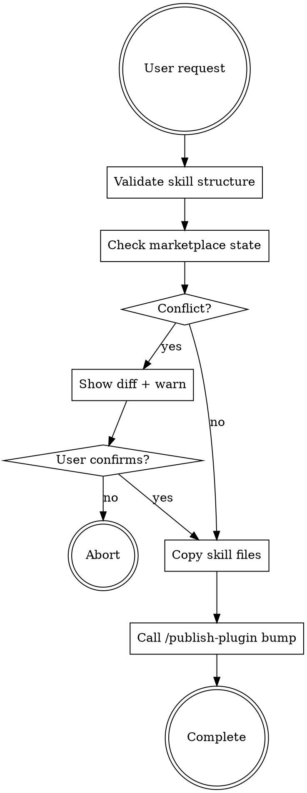

# Deploy to Marketplace

Deploy skills from `~/.claude/skills/` to the saurun-marketplace plugin repository.

## Workflow



## Steps

### 1. Validate Skill Structure

Check source skill:
```bash
SKILL_NAME="skill-name"
SOURCE="$HOME/.claude/skills/$SKILL_NAME"

# Verify exists
test -f "$SOURCE/SKILL.md" || { echo "Error: SKILL.md not found"; exit 1; }

# Verify frontmatter
grep -q "^name:" "$SOURCE/SKILL.md" || { echo "Error: Missing 'name' in frontmatter"; exit 1; }
grep -q "^description:" "$SOURCE/SKILL.md" || { echo "Error: Missing 'description' in frontmatter"; exit 1; }
```

### 2. Check Marketplace State

```bash
MARKETPLACE="$HOME/repos/saurun-marketplace"
TARGET="$MARKETPLACE/plugins/saurun/skills/$SKILL_NAME"

# Check if skill exists
if [ -d "$TARGET" ]; then
    # Compare modification times
    LOCAL_TIME=$(stat -f %m "$SOURCE/SKILL.md" 2>/dev/null || stat -c %Y "$SOURCE/SKILL.md")
    MARKET_TIME=$(stat -f %m "$TARGET/SKILL.md" 2>/dev/null || stat -c %Y "$TARGET/SKILL.md")

    if [ "$MARKET_TIME" -gt "$LOCAL_TIME" ]; then
        echo "⚠️  WARNING: Marketplace version is NEWER than local"
        echo "Local:       $(date -r $LOCAL_TIME)"
        echo "Marketplace: $(date -r $MARKET_TIME)"

        # Show diff
        diff -u "$TARGET/SKILL.md" "$SOURCE/SKILL.md" || true

        # Ask user
        echo ""
        echo "Options:"
        echo "  1. ABORT - Don't deploy"
        echo "  2. REVERSE - Copy marketplace → local"
        echo "  3. FORCE - Overwrite marketplace (use with caution)"
        # Wait for user decision
    fi
fi

# Check git state
cd "$MARKETPLACE"
if ! git diff --quiet; then
    echo "⚠️  WARNING: Marketplace has uncommitted changes"
    git status --short
    # Ask user to commit or continue
fi
```

### 3. Copy Skill Files

**Platform detection:**
```bash
# Detect platform
case "$(uname -s)" in
    Darwin|Linux)  PLATFORM="unix" ;;
    MINGW*|MSYS*)  PLATFORM="windows" ;;
    *)             PLATFORM="unix" ;;
esac
```

**Copy command:**
```bash
if [ "$PLATFORM" = "unix" ]; then
    # Mac/Linux: Use rsync
    rsync -av --delete "$SOURCE/" "$TARGET/"
else
    # Windows: Use robocopy or cp
    cp -r "$SOURCE"/* "$TARGET/"
fi
```

### 4. Call `/publish-plugin bump`

This command handles:
- Version bumping (both plugin.json and marketplace.json)
- Git commit with standardized message
- Git push to origin

```bash
# Just invoke the command
/publish-plugin bump
```

**The command will:**
- Increment version: `1.0.16` → `1.0.17`
- Update both JSON files
- Commit: `chore(plugin): publish plugin v1.0.17`
- Push to GitHub

## Quick Reference

**Deploy skill:**
```bash
# Example: Deploy web-design-wizard
SKILL="web-design-wizard"
rsync -av --delete ~/.claude/skills/$SKILL/ \
    ~/repos/saurun-marketplace/plugins/saurun/skills/$SKILL/

cd ~/repos/saurun-marketplace
/publish-plugin bump
```

## Common Issues

| Issue | Solution |
|-------|----------|
| "SKILL.md not found" | Verify skill exists in ~/.claude/skills/ |
| "Missing frontmatter" | Add name and description to ---...--- block |
| "Marketplace is newer" | Show diff, ask user to confirm overwrite |
| "Uncommitted changes" | Ask user to commit or stash first |
| "Git push fails" | Check network, credentials, conflicts |

## Supporting Files

The workflow automatically copies entire skill directory, including:
- `SKILL.md` (required)
- `references/` (optional)
- `scripts/` (optional)
- Any other supporting files

## Safety Checks (Always Performed)

- ✅ Validate SKILL.md exists
- ✅ Validate frontmatter present
- ✅ Check marketplace git state
- ✅ Compare modification times
- ✅ Show diff if overwriting
- ✅ Ask user confirmation on conflicts

**Never skip these checks, even under time pressure.**
