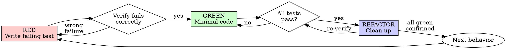

# .NET Test-Driven Development (TDD)

## Overview

Write the test first. Watch it fail. Write minimal code to pass.

**Core principle:** If you didn't watch the test fail, you don't know if it tests the right thing.

**Violating the letter of the rules is violating the spirit of the rules.**

## Quick Reference

| Step | Action | Verify |
|------|--------|--------|
| RED | Write one failing test | Fails for expected reason (missing feature, not typo) |
| GREEN | Write minimal code to pass | This test + all others pass |
| REFACTOR | Clean up, no new behavior | All tests still green |
| Mock rule | Mock infrastructure only | Domain objects are real, never mocked |
| Naming | `MethodName_Scenario_ExpectedBehavior` | Clear, behavioral, no `CanSet*` |
| Assertions | Max 3 per test | Use `[Theory]` for parameterized cases |

## When to Use

**Always:** New features, bug fixes, refactoring, behavior changes.

**Exceptions (ask your human partner):** Throwaway prototypes, generated code, configuration files.

Thinking "skip TDD just this once"? Stop. That's rationalization.

## The Iron Laws

```
1. NO PRODUCTION CODE WITHOUT A FAILING TEST FIRST
2. NEVER add test-only methods to production classes
3. MOCK BOUNDARY RULE (see below)
```

Write code before the test? Delete it. Start over.

**No exceptions:**
- Don't keep it as "reference"
- Don't "adapt" it while writing tests
- Don't look at it
- Delete means delete

### Mock Boundary Rule

**Mock infrastructure. NEVER mock domain.**

**OK to mock:** `DbContext`/repositories, `IHttpClientFactory`, `ILogger<T>`, `TimeProvider`, external API clients, message queues, file systems.

**NEVER mock:** Domain entities, value objects, pure functions, domain services with no I/O.

**Use NSubstitute** for all mocking. Not Moq, not FakeItEasy.

```csharp
// OK: mocking infrastructure
var repo = Substitute.For<IShoppingListRepository>();
repo.GetByIdAsync(listId).Returns(existingList);

// NEVER: mocking domain
var item = Substitute.For<ShoppingItem>(); // NO. Use real entity.
var item = new ShoppingItem("Milk", Category.Dairy); // YES.
```

## What to Test

**Test behavior, not structure.** Ask: "If this test didn't exist, what bug could ship?" If "none" -- delete it.

**DO test:** Public method behavior, edge cases, error paths, state transitions, integration (HTTP -> response -> DB state).

**DO NOT test:** Getters/setters, constructor property assignment, framework behavior, private methods.

**Integration test rule:** Assert response body or DB state, not just HTTP status. `response.EnsureSuccessStatusCode()` alone proves nothing — verify the actual data.

**No assertion-less tests:** A test with zero assertions is always a bug. It passes silently and catches nothing.

<Bad>
```csharp
[Fact]
public void CanSetProperties()
{
    var item = new ShoppingItem();
    item.Name = "Milk";
    Assert.Equal("Milk", item.Name);
}
```
Tests language feature, not behavior. Would never catch a bug.
</Bad>

## Red-Green-Refactor



### RED - Write Failing Test

One minimal test showing desired behavior. Run it. Confirm it fails because the feature is missing (not typos/errors).

```csharp
[Fact]
public async Task AddItem_WithValidName_AddsItemToList()
{
    var list = new ShoppingList("Weekly Groceries", householdId);
    list.AddItem("Milk", Category.Dairy);
    Assert.Single(list.Items);
    Assert.Equal("Milk", list.Items[0].Name);
}
```

**Requirements:** One behavior per test. Clear name: `MethodName_Scenario_ExpectedBehavior`. Real domain objects.

### GREEN - Minimal Code

Write simplest code to pass. Don't add features, refactor, or "improve" beyond the test.

### REFACTOR

After green only: remove duplication, improve names, extract helpers. Keep all tests green.

## Naming Convention

```
MethodName_Scenario_ExpectedBehavior
```

Examples: `AddItem_WithEmptyName_ThrowsArgumentException`, `GetNearbyStores_WithNoStoresInRange_ReturnsEmptyList`

## Assertion Rules

**Max 3 assertions per test.** More than 3? Split. Use `[Theory]` + `[InlineData]` for parameterized tests.

**Single logical assertion is fine even with multiple Assert calls** (e.g., checking name + category of one added item).

## Shared Test Infrastructure

Create ONE shared `CustomWebApplicationFactory` for integration tests. Use SQLite in-memory with kept-alive connection, NOT the EF InMemory provider.

**REFERENCE:** See testing-anti-patterns.md, Anti-Pattern 6 for the full `CustomWebApplicationFactory` implementation and usage pattern.

## Common Rationalizations

| Excuse | Reality |
|--------|---------|
| "Too simple to test" | Simple code breaks. Test takes 30 seconds. |
| "I'll test after" | Tests passing immediately prove nothing -- you never saw it catch the bug. |
| "Tests after achieve same goals" | Tests-after = "what does this do?" Tests-first = "what should this do?" |
| "Already manually tested" | Ad-hoc != systematic. No record, can't re-run. |
| "Deleting X hours is wasteful" | Sunk cost fallacy. Keeping unverified code is technical debt. |
| "Keep as reference, write tests first" | You'll adapt it. That's testing after. Delete means delete. |
| "Need to explore first" | Fine. Throw away exploration, start with TDD. |
| "Test hard = design unclear" | Listen to test. Hard to test = hard to use. |
| "TDD will slow me down" | TDD faster than debugging. Pragmatic = test-first. |

## Red Flags - STOP and Start Over

- Code before test / test after implementation
- Test passes immediately
- Can't explain why test failed
- Rationalizing "just this once" or "this is different because..."
- Testing getters/setters (`CanSetName`, `HasInitializedCollections`)
- Testing that a mock was called instead of testing real behavior
- More than 3 assertions / no `[Theory]` for multiple inputs
- Test with zero assertions (passes silently, catches nothing)
- Integration test only asserts HTTP status code, not response body or DB state
- "Already spent X hours, deleting is wasteful"

**All of these mean: Delete code. Start over with TDD.**

## When Stuck

| Problem | Solution |
|---------|----------|
| Don't know how to test | Write wished-for API. Write assertion first. Ask your human partner. |
| Test too complicated | Design too complicated. Simplify interface. |
| Must mock everything | Code too coupled. Use dependency injection. |
| Test setup huge | Extract to shared helpers/factory. Still complex? Simplify design. |

## Testing Anti-Patterns

**REFERENCE:** See testing-anti-patterns.md for the full list of anti-patterns with examples and gate functions.

## Final Rule

```
Production code -> test exists and failed first
Otherwise -> not TDD
```

No exceptions without your human partner's permission.
