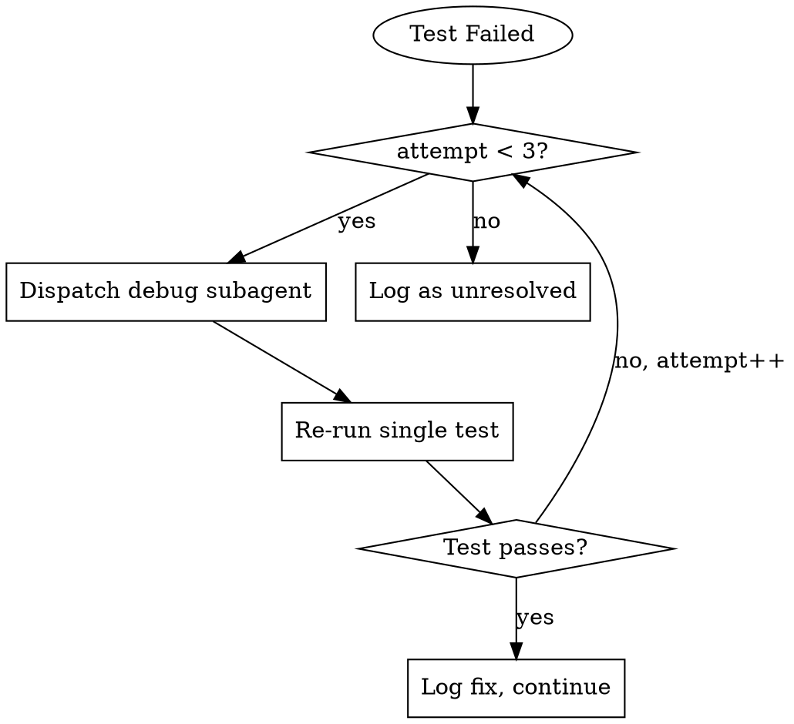

# E2E Testing Skill

Run Playwright E2E tests against User Flows from a product spec. Self-contained lifecycle: detects project → starts app → runs tests → tears down. Auto-fix loop with up to 3 attempts per failing test.

## When to Use

- Spec has `## User Flows` section ready to validate
- Frontend components have `data-testid` attributes
- Need demo videos for stakeholder review
- Pre-release QA gate
- Verifying user journeys after feature implementation

## When NOT to Use

- Unit or integration testing (use appropriate test runners)
- No spec with User Flows defined
- API-only testing without UI
- Performance/load testing
- Frontend lacks `data-testid` coverage

## Prerequisites

- Product spec with `## User Flows` section
- Frontend with `data-testid` attributes on interactive elements
- Backend with a health endpoint (auto-detected)

## Execution Flow

### Step 0: Detect Project

Run project detection per [references/project-detection.md](references/project-detection.md).

This establishes all config variables used in subsequent steps:
- `{FRONTEND_DIR}`, `{BACKEND_DIR}` — project directories
- `{FRONTEND_START_CMD}`, `{BACKEND_START_CMD}` — start commands
- `{HEALTH_ENDPOINT}` — backend readiness check
- `{DEFAULT_FRONTEND_PORT}`, `{DEFAULT_BACKEND_PORT}` — port defaults
- `{TEST_DIR}` — Playwright test directory
- `{RESULTS_DIR}` — output directory for reports and artifacts

Log detected config to stdout. If detection fails on any critical item, warn and ask the user for clarification. In autonomous mode (invoked by another skill), make best guess.

### Step 1: Find Spec File

```
If argument provided:
  spec_path = argument
Else:
  Search in order:
    _docs/specs/*-spec.md, _docs/specs/*.md (exclude *-architecture.md)
    docs/specs/*.md
    docs/*.spec.md
    specs/*.md
    *.spec.md (project root)
  Use most recently modified match.
```

### Step 2: Extract User Flows

Parse the `## User Flows` section from the spec file. Each flow has:
- Name (heading)
- Steps (numbered list)
- Expected outcomes

### Step 3: Ensure Playwright Setup

Check if Playwright is configured:

```bash
# If playwright.config.ts doesn't exist in {FRONTEND_DIR}
cd {FRONTEND_DIR} && npm install -D @playwright/test && npx playwright install chromium
```

Create or update `{FRONTEND_DIR}/playwright.config.ts` using the template in [references/playwright-config.md](references/playwright-config.md).

### Step 4: Generate Test Files

For each User Flow, generate a Playwright test file in `{TEST_DIR}`.

See [references/test-generation.md](references/test-generation.md) for mapping rules.

Example output:
```typescript
// {TEST_DIR}/create-recipe.spec.ts
import { test, expect } from '@playwright/test';

test('Create Recipe flow', async ({ page }) => {
  // Step 1: User clicks "New Recipe" button
  await page.goto('/');
  await page.getByTestId('navbar-new-recipe').click();

  // Step 2: User fills in title, description, cook time
  await page.getByTestId('recipe-form-title').fill('Test Recipe');
  await page.getByTestId('recipe-form-description').fill('A test recipe');
  await page.getByTestId('recipe-form-cooktime').fill('30');

  // Step 3: User clicks "Save"
  await page.getByTestId('recipe-form-submit').click();

  // Step 4: System shows success
  await expect(page.getByTestId('toast-success')).toBeVisible();
});
```

### Step 5-8: Server Lifecycle & Run Tests

See [references/server-lifecycle.md](references/server-lifecycle.md) for scripts.

1. **Find ports** — dynamically allocate to avoid conflicts
2. **Start backend** — `{BACKEND_START_CMD}`, wait for `{HEALTH_ENDPOINT}` (60s timeout)
3. **Start frontend** — `{FRONTEND_START_CMD}`, wait for response (30s timeout)
4. **Run Playwright** — `cd {FRONTEND_DIR} && npx playwright test --reporter=html,json`

### Step 9: Process Results & Fix Loop

For each failing test, run the fix loop (see below). After fixes, re-run full suite.

### Step 10: Generate Report

Write to `{RESULTS_DIR}/report.md` using [references/report-template.md](references/report-template.md).

### Step 11: Teardown

Kill backend and frontend processes. See [references/server-lifecycle.md](references/server-lifecycle.md).

---

## Fix Loop (Per Failing Test)



**Subagent dispatch:**
```
Task(subagent_type="general-purpose", prompt="""
  {AUTONOMOUS_PREAMBLE}  // See references/autonomous-preamble.md
  SKILL TO LOAD: superpowers:systematic-debugging

  E2E TEST FAILURE:
  - Test: {path} / {name}
  - Error: {message}
  - Screenshot: {path}, Trace: {path}

  USER FLOW: {original steps from spec}
  CODE: Frontend: {path}, Backend: {path}, Test: {path}

  DIAGNOSE → FIX → VERIFY (compiles/builds)
""")
```

Re-run: `cd {FRONTEND_DIR} && npx playwright test {file} --grep "{name}"`

Log attempts to `{RESULTS_DIR}/fix-attempts/{test-name}.md`

---

## Failure Categorization

See [references/failure-categories.md](references/failure-categories.md) for detailed patterns.

| Pattern | Category |
|---------|----------|
| Connection refused / timeout on startup | `infra` |
| Element not found + selector issue | `test-code` |
| Element not found + missing in DOM | `app-code` |
| Assertion failed on content | `app-code` |
| Timeout waiting for element (intermittent) | `flaky` |

---

## Artifact Structure

```
{RESULTS_DIR}/
├── report.md                    # Main report
├── videos/
│   ├── create-recipe.webm
│   └── ...
├── failures/                    # Only if unresolved
│   ├── {test}-screenshot.png
│   └── {test}-trace.zip
└── fix-attempts/
    └── {test}.md                # Diagnosis + fix log
```

---

## Report Template

See [references/report-template.md](references/report-template.md) for the full report template.

Write to `{RESULTS_DIR}/report.md` with: summary stats, video links, fix attempt logs, unresolved failures table, and category breakdown.
