# React Test-Driven Development (TDD)

## Overview

Write the test first. Watch it fail. Write minimal code to pass.

**Core principle:** If you didn't watch the test fail, you don't know if it tests the right thing.

**Violating the letter of the rules is violating the spirit of the rules.**

## Quick Reference

| Step | Action | Verify |
|------|--------|--------|
| RED | Write one failing test | Fails for expected reason (missing component/function, not typo) |
| GREEN | Write minimal code to pass | This test + all others pass |
| REFACTOR | Clean up, no new behavior | All tests still green |
| Commit | After each green cycle | `git commit` with passing tests |
| Mock rule | Mock API boundaries only (MSW) | Zustand stores, domain logic, React components are real |
| Naming | `it('should [behavior] when [condition]')` | Behavioral, no `CanSet*` |
| Assertions | Max 3 per test | Use `it.each`/`describe.each` for parameterized cases |

## When to Use

**Always:** New features, bug fixes, refactoring, behavior changes.

**Exceptions (ask your human partner):** Throwaway prototypes, generated code, configuration files.

Thinking "skip TDD just this once"? Stop. That's rationalization.

## The Iron Laws

```
1. NO IMPLEMENTATION CODE WITHOUT A FAILING TEST FIRST
2. NEVER add test-only methods/props to production components
3. MOCK BOUNDARY RULE (see below)
4. COMMIT after each green cycle
```

Write code before the test? Delete it. Start over.

**No exceptions:**
- Don't keep it as "reference"
- Don't `git stash` it "for domain knowledge"
- Don't "adapt" it while writing tests
- Don't look at it
- Delete means delete — `git checkout .` or `rm`, not stash

### Mock Boundary Rule

**Mock API boundaries with MSW. NEVER mock domain logic or React internals.**

**OK to mock (MSW):** HTTP endpoints (`http.get`, `http.post`), WebSocket connections, external service APIs.

**OK to mock (vi.mock):** `window.location`, `navigator.*`, timers (`vi.useFakeTimers`), `IntersectionObserver`, `ResizeObserver`.

**NEVER mock:** Zustand stores, React components, custom hooks, utility functions, domain logic, event handlers.

```tsx
// OK: MSW for API boundary
import { http, HttpResponse } from 'msw'
server.use(
  http.get('/api/products/:id', () => {
    return HttpResponse.json({ id: '1', name: 'Widget', price: 9.99 })
  })
)

// NEVER: mocking Zustand store
vi.mock('../stores/useCartStore') // NO. Use real store.

// NEVER: mocking child components
vi.mock('./CartItem') // NO. Render real component.
```

## What to Test

**Test behavior, not structure.** Ask: "If this test didn't exist, what bug could ship?" If "none" — delete it.

**Priority hierarchy:**
1. User-visible behavior (click, type, see result)
2. State transitions (store actions producing correct state)
3. Integration boundaries (component + API via MSW)
4. Edge cases (empty, null, boundary values)

**NEVER test:** Prop types, component renders without crashing, that a className exists, store getter values, hook return shapes.

**No assertion-less tests:** A test with zero assertions is always a bug. It passes silently and catches nothing.

### "What Bugs Do These Tests Catch?" Table

**REQUIRED for every test plan.** Before writing tests, create this table:

| Test | Bug It Catches |
|------|---------------|
| `should show empty state when cart has no items` | Empty cart renders product list instead of empty message |
| `should update total when quantity changes` | Total doesn't recalculate on quantity change |

If you can't fill the "Bug It Catches" column — don't write the test.

## Red-Green-Refactor

```dot
digraph tdd_cycle {
    rankdir=LR;
    red [label="RED\nWrite failing test", shape=box, style=filled, fillcolor="#ffcccc"];
    verify_red [label="Verify fails\ncorrectly", shape=diamond];
    green [label="GREEN\nMinimal code", shape=box, style=filled, fillcolor="#ccffcc"];
    verify_green [label="All tests\npass?", shape=diamond];
    refactor [label="REFACTOR\nClean up", shape=box, style=filled, fillcolor="#ccccff"];
    commit [label="COMMIT\ngit commit", shape=box, style=filled, fillcolor="#ffffcc"];
    next [label="Next behavior", shape=ellipse];

    red -> verify_red;
    verify_red -> green [label="yes"];
    verify_red -> red [label="wrong\nfailure"];
    green -> verify_green;
    verify_green -> refactor [label="yes"];
    verify_green -> green [label="no"];
    refactor -> verify_green [label="re-verify"];
    refactor -> commit [label="all green"];
    commit -> next;
    next -> red;
}
```



### RED - Write Failing Test

One minimal test showing desired behavior. Run it. Confirm it fails because the feature is missing (not typos/import errors).

```tsx
import { render, screen } from '@testing-library/react'
import { CartPage } from './CartPage'

it('should show empty message when cart has no items', () => {
  render(<CartPage />)
  expect(screen.getByText(/your cart is empty/i)).toBeInTheDocument()
})
```

**Requirements:** One behavior per test. Clear name: `it('should [behavior] when [condition]')`. Real components, real stores.

### GREEN - Minimal Code

Write simplest code to pass. Don't add features, refactor, or "improve" beyond the test.

### REFACTOR

After green only: remove duplication, improve names, extract helpers. Keep all tests green.

### COMMIT

After refactor and all tests green: `git commit`. Every green cycle gets a commit.

## Naming Convention

```
it('should [expected behavior] when [condition/action]')
```

Examples:
- `it('should add item to cart when add button is clicked')`
- `it('should show error message when API returns 404')`
- `it('should disable submit button when form is invalid')`

## Assertion Rules

**Max 3 assertions per test.** More than 3? Split. Use `it.each` for parameterized tests.

**Single logical assertion is fine even with multiple expect calls** (e.g., checking name + price of one added item).

```tsx
// GOOD: parameterized tests
it.each([
  { quantity: 1, price: 10, expected: 10 },
  { quantity: 3, price: 5.5, expected: 16.5 },
  { quantity: 0, price: 99, expected: 0 },
])('should calculate total as $expected when quantity=$quantity and price=$price',
  ({ quantity, price, expected }) => {
    // ...test body
  }
)
```

## Custom Render Wrapper

**REQUIRED:** Create ONE shared render wrapper for tests needing providers.

```tsx
// src/test/test-utils.tsx
import { render, type RenderOptions } from '@testing-library/react'
import { type ReactElement } from 'react'
import { MemoryRouter } from 'react-router-dom'

function AllProviders({ children }: { children: React.ReactNode }) {
  return (
    <MemoryRouter>
      {children}
    </MemoryRouter>
  )
}

function customRender(ui: ReactElement, options?: Omit<RenderOptions, 'wrapper'>) {
  return render(ui, { wrapper: AllProviders, ...options })
}

export * from '@testing-library/react'
export { customRender as render }
```

**For Zustand:** Reset stores in `beforeEach`, don't mock them.

```tsx
// src/test/setup.ts
import { beforeEach } from 'vitest'
import { useCartStore } from '../stores/useCartStore'

beforeEach(() => {
  useCartStore.getState().clearCart() // Use real store action, not setState
})
```

## MSW Patterns

**Global setup in `vitest.setup.ts`:**

```tsx
import { beforeAll, afterEach, afterAll } from 'vitest'
import { server } from './mocks/server'

beforeAll(() => server.listen({ onUnhandledRequest: 'error' }))
afterEach(() => server.resetHandlers())
afterAll(() => server.close())
```

**Per-test overrides for error cases:**

```tsx
import { server } from '../mocks/server'
import { http, HttpResponse } from 'msw'

it('should show error when API fails', async () => {
  server.use(
    http.get('/api/products/:id', () => HttpResponse.error())
  )
  // ...test
})
```

**Handler organization:** One `handlers.ts` per API domain, aggregated in `server.ts`.

## Self-Review Questions

Before marking any test as done, ask yourself:

1. **"Would this test catch a real bug?"** — If no, delete it.
2. **"Am I testing behavior or implementation details?"** — If testing that a mock was called, stop.
3. **"Did I watch this test fail first?"** — If it passed immediately, it proves nothing.
4. **"Is my test name a complete sentence?"** — `should [x] when [y]`.

## Common Rationalizations

| Excuse | Reality |
|--------|---------|
| "Too simple to test" | Simple code breaks. Test takes 30 seconds. |
| "I'll test after" | Tests passing immediately prove nothing — you never saw it catch the bug. |
| "Tests after achieve same goals" | Tests-after = "what does this do?" Tests-first = "what should this do?" |
| "Already manually tested in browser" | Ad-hoc != systematic. No record, can't re-run. |
| "Deleting X hours of code is wasteful" | Sunk cost fallacy. Keeping unverified code is technical debt. |
| "Keep as reference, write tests first" | You'll adapt it. That's testing after. Delete means delete. |
| "Git stash it for domain knowledge" | Stash = reference with extra steps. Delete means delete. |
| "Need to explore first" | Fine. Throw away exploration, start with TDD. |
| "TDD is for new work, not retroactive" | If code exists without tests, delete it and do TDD. No exceptions. |
| "Personal time matters more" | Stop working. Resume with TDD tomorrow. Don't commit untested code. |
| "Just the critical tests for now" | Partial testing = false confidence. TDD or don't commit. |
| "Being pragmatic, not dogmatic" | Pragmatic = test-first. Shortcuts = debt. |

## Red Flags - STOP and Start Over

- Code before test / test after implementation
- Test passes immediately (never saw it fail)
- Can't explain why test failed
- Rationalizing "just this once" or "this is different because..."
- Testing that a className/prop exists (`CanSetProperties` equivalent)
- Testing that a mock was called instead of real behavior
- More than 3 unrelated assertions / no `it.each` for multiple inputs
- Test with zero assertions
- `vi.mock` on Zustand stores, components, or custom hooks
- "Already spent X hours, deleting is wasteful"
- Committing without tests "for now"

**All of these mean: Delete code. Start over with TDD.**

## Testing Anti-Patterns

### CanSetProperties (React equivalent)

```tsx
// BAD: Tests React rendering, not behavior
it('renders with correct class', () => {
  render(<Button variant="primary" />)
  expect(screen.getByRole('button')).toHaveClass('bg-blue-500')
})
```

Tests CSS, not behavior. Delete.

### MockVerifyOnly

```tsx
// BAD: Tests mock was called, not behavior
it('calls addItem on click', () => {
  const mockAdd = vi.fn()
  vi.mock('../stores/useCartStore', () => ({ useCartStore: () => ({ addItem: mockAdd }) }))
  render(<AddToCartButton productId="1" />)
  fireEvent.click(screen.getByRole('button'))
  expect(mockAdd).toHaveBeenCalledWith(/* ... */) // Testing mock!
})
```

Use real store. Assert real state changed.

### Assertionless

```tsx
// BAD: Passes silently, catches nothing
it('renders without crashing', () => {
  render(<CartPage />)
})
```

Always has at least one meaningful assertion.

### StatusCodeOnly (API test equivalent)

```tsx
// BAD: Only checks fetch was called, not result
it('fetches product', async () => {
  render(<AddToCartButton productId="1" />)
  await userEvent.click(screen.getByRole('button'))
  // No assertion on what happened after fetch!
})
```

Assert the UI change or store state after the API call completes.

## When Stuck

| Problem | Solution |
|---------|----------|
| Don't know how to test | Write wished-for UI. Write assertion first: `expect(screen.getByText('...')).toBeInTheDocument()` |
| Test too complicated | Component too complicated. Extract smaller component. |
| Must mock everything | Code too coupled. Lift state up, use dependency injection via props/context. |
| Test setup huge | Extract to custom render wrapper. Still complex? Simplify component. |
| Async timing issues | Use `waitFor`, `findBy*` queries. Never `setTimeout` in tests. |
| Zustand store hard to test | Test through component rendering, not `getState()` directly. |

## Final Rule

```
Implementation code -> test exists and failed first
Otherwise -> not TDD
```

No exceptions without your human partner's permission.
