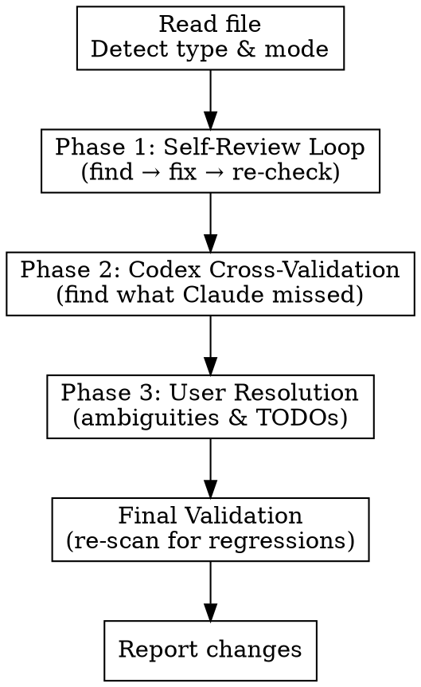

# Doc Polisher

Iteratively improve any document through multi-phase review.

## Design Principle

**In-place enhancement.** Keep format, structure, and author voice intact. Fix content, not layout.

## Phases



## Parameters

Detect from user's request:

| Parameter | Trigger | Effect |
|-----------|---------|--------|
| `codex-fix` | "let Codex fix", "Codex can fix" | Codex fixes directly with `--full-auto` |
| `aggressive` | "make concise", "trim down" | More aggressive content removal |
| `conservative` | "minimal changes", "careful" | Only fix clear errors |

## Issue Categories

Two buckets only:

**Auto-fixable** (no user input needed):
- Inconsistent terminology (when one term >70% dominant)
- Redundant content
- Formatting inconsistency (mixed bullets, heading hierarchy)
- Broken internal references (when target can be auto-resolved)
- Trailing whitespace, incomplete lists

**Requires user input** (NEVER guess, NEVER fabricate):
- Vague instructions ("handle appropriately", "configure as needed")
- Ambiguous scope ("update the configuration" — which one?)
- Unresolved TODOs/FIXMEs
- Missing context or definitions
- Contradictions
- Inconsistent terminology (when no term >70% dominant)

See `references/issue-criteria.md` for full enumeration with severity levels and detection patterns.

## Critical Rules

### NEVER Fabricate Content

```
RED FLAG: You are about to write specific content the user never provided.

STOP. ASK THE USER.

Examples of fabrication:
- Replacing "configure appropriately" with specific config steps you invented
- Replacing a TODO with a decision you made
- Adding file paths, branch names, or commands not in the original doc
- Converting a vague instruction into a specific one using your assumptions

The user's document has vague content for a reason — they haven't decided yet,
or the answer depends on context you don't have. ASK, don't guess.
```

### NEVER Skip User Consultation for Ambiguous Issues

Reformatting a TODO (e.g., `TODO: X` → `> **Open question:** X`) is NOT resolving it. The user must decide:
- What value/content to use, OR
- Explicitly keep it as-is (deferred), OR
- Remove it entirely

### Always Re-verify After Fixes

A single pass misses issues introduced by fixes. Always re-scan after applying changes.

## Workflow

### Phase 1: Self-Review Loop

```
max_iterations = 5
changes = []

for iteration in 1..max_iterations:
    1. Spawn issue-finder agent:
       Task(subagent_type="general-purpose", prompt=<issue-finder prompt with file_path, file_type, mode>)

    2. Parse response → auto_fixable_issues, user_issues

    3. If no auto_fixable issues with severity critical or major:
       Fix remaining minor auto-fixable issues
       Store user_issues for Phase 3
       → Exit Phase 1

    4. For each auto_fixable issue (critical first):
       Skip if already attempted (track by type+location+quote hash)
       Spawn issue-fixer agent to apply fix
       Record in changes[]

    5. Continue loop (re-scan will catch regressions)

Report: "Phase 1: Fixed N issues in M iterations"
```

### Phase 2: Codex Cross-Validation

**Setup:**

Resolve `CODEX_BRIDGE` path using the Glob tool (NOT bash — `Bash(node:*)` restriction blocks `ls`):
```
Glob(pattern="**/saurun/*/skills/codex-bridge/codex-bridge.mjs", path="~/.claude/plugins/cache/saurun-marketplace")
→ Use the LAST match (highest version number)
→ Store as CODEX_BRIDGE variable for subsequent node commands
```

```
CODEX_TIMEOUT=1200000  # 20 min — MANDATORY, do not shorten
```

**Codex is required.** Always attempt Phase 2. If Codex is unavailable (not installed, auth failure, timeout), log a warning and proceed to Phase 3, but flag this prominently in the report. Do NOT skip Phase 2 by choice.

```
for iteration in 1..5:
    1. Call Codex via codex-bridge with review prompt (see below)
       CRITICAL: Always pass --working-dir and --timeout 1200000

    2. Parse JSON response, validate schema (see references/issue-criteria.md for valid types)
       - Missing required fields → skip issue
       - Unknown type → treat as non-auto-fixable
       - Missing suggestions array → normalize

    3. For each Codex finding:
       Spawn codex-validator agent → VALID or INVALID
       If INVALID → log rejection, skip

    4. If no valid issues → exit Phase 2

    5. For valid issues:
       Auto-fixable → spawn issue-fixer, record change
       Needs user → add to user_issues for Phase 3

Report: "Phase 2: Fixed N issues, deferred M to user"
```

**Default Codex prompt:**

**CRITICAL: Do NOT embed the full document in the prompt.** Codex truncates long prompts (file-based relay triggers at >7000 chars, and Codex may further truncate file content). Instead, tell Codex the file path and let it read the file directly.

```bash
node "$CODEX_BRIDGE" --timeout 1200000 "Review the document at [ABSOLUTE_FILE_PATH] for issues that may have been missed.

DOCUMENT TYPE: [file_type]
MODE: [mode]

Read the file first, then look for:
1. Vague instructions (reader must guess intent)
2. Inconsistent terminology (same concept, different names)
3. Missing information (referenced but not defined)
4. Redundant content (same thing said multiple ways)
5. Unclear scope (ambiguous boundaries)
6. Broken references (links to non-existent things)
7. Unresolved placeholders (TODOs, TBDs)

DO NOT FLAG:
- Stylistic preferences (unless inconsistent)
- Subjective 'could be better' suggestions
- Things already fixed

Return JSON array:
[{
  \"issue\": \"description\",
  \"type\": \"vague_instruction|inconsistent_terminology|broken_reference|redundant_content|formatting_inconsistency|missing_definition|contradiction|unresolved_todo|ambiguous_scope|missing_context|trailing_whitespace|incomplete_list\",
  \"severity\": \"critical|major|minor\",
  \"location\": \"line number or section\",
  \"quote\": \"the problematic text\",
  \"auto_fixable\": true|false,
  \"suggestions\": [\"fix options\"]
}]

If no issues: []
" --working-dir "$PROJECT_PATH"
```

**Why not embed content?** When the prompt + document > 7000 chars, `codex-bridge.mjs` writes to a temp file and tells Codex to "read .codex-bridge-prompt.txt". But Codex may truncate that file's content (observed: "N tokens truncated"), causing it to review an incomplete document and produce false positives. By giving Codex the real file path, it reads the file directly at full fidelity.

**Codex-fix mode** (when `codex-fix` parameter detected): Add `--full-auto` flag. Codex edits directly. Validate fixes with codex-validator. Revert if invalid.

### Phase 3: User Resolution

**Only issues where `auto_fixable == false` reach this phase.**

**CRITICAL: Use the AskUserQuestion TOOL for each issue, one at a time.** Do NOT list questions as plain text. Each issue gets its own AskUserQuestion call so the user gets interactive multiple-choice prompts.

```
If no user_issues → skip to validation

For each issue (sorted by severity):
    Call AskUserQuestion tool with issue-type-specific options:

    vague_instruction:
      "This is vague: '[quote]'. What should it specify?"
      Options: [suggestion1, suggestion2, "Keep as-is", "Remove"]

    ambiguous_scope:
      "'[quote]' could mean different things. Which interpretation?"
      Options: [interp_a, interp_b, "Both (clarify)", "Keep ambiguous"]

    unresolved_todo:
      "Found unresolved: '[quote]'"
      Options: [suggestion, "Remove entirely", "Keep (resolve later)"]

    inconsistent_terminology:
      "Mixed terms: [term1] (Nx), [term2] (Nx). Standardize to which?"
      Options: ["Use term1", "Use term2", "Keep as-is (different meanings)"]

    contradiction:
      "'[quote1]' conflicts with '[quote2]'"
      Options: ["Keep first", "Keep second", "Rewrite to reconcile", "Keep both"]

    missing_definition / missing_context:
      "'[quote]' is used but never defined/assumes knowledge not provided"
      Options: [suggestion, "Link to docs", "Remove", "Keep as-is"]

    broken_reference (unresolvable):
      "'[quote]' points to non-existent target"
      Options: [suggested_target, "Remove reference", "Keep (fix later)"]

    Apply user's choice via issue-fixer agent
    Record in changes[]

Report: "Phase 3: Resolved N ambiguities"
```

### Final Validation

```
1. Run issue-finder one last time (conservative mode)
2. Filter out pre-existing issues → find genuinely NEW issues from our fixes
3. If new issues → warn user with list + likely cause
4. If clean → report "Validation passed"
```

### Report

Print summary:
```
File: [name]  Type: [type]  Mode: [mode]
Phase 1: [N] fixed in [M] iterations
Phase 2: [N] fixed, [M] deferred  [or "Skipped (Codex unavailable)"]
Phase 3: [N] resolved by user
Validation: Passed | [N] regressions found
Total: [N] issues fixed (Claude: X, Codex: Y, User: Z)
```

Include abbreviated change log: `[phase-iteration-change#] type @ location: before → after`

## Sub-Agents

| Agent | Purpose | Prompt Template Location |
|-------|---------|--------------------------|
| issue-finder | Analyze document, return structured issue list | `agents/issue-finder.md` |
| issue-fixer | Fix ONE specific issue in-place | `agents/issue-fixer.md` |
| codex-validator | Validate Codex finding is genuine (not subjective/false positive) | `agents/codex-validator.md` |

Spawn each via `Task(subagent_type="general-purpose")` with the agent's prompt + input parameters.

## Red Flags — STOP and Re-read This Skill

- You're about to replace vague content with specifics YOU made up
- You converted a TODO to a different format without asking the user
- You're doing a single pass without re-scanning
- You skipped Phase 2 because "Phase 1 was thorough enough"
- You're not tracking changes
- You resolved an ambiguity without AskUserQuestion
- You listed questions as plain text instead of calling AskUserQuestion tool

**All of these mean: you're violating the skill. Re-read and comply.**

## Common Rationalizations

| Excuse | Reality |
|--------|---------|
| "I can infer what the user meant" | You can't. Vague content exists because the user hasn't decided. Ask. |
| "Reformatting the TODO is better than leaving it raw" | Changing format ≠ resolving. The decision is still unmade. Ask. |
| "One pass is enough, I was thorough" | You always miss things. Re-scan catches regressions from fixes. |
| "Phase 2 would just find the same issues" | Codex has different blind spots than Claude. That's the point. |
| "The user would probably want X" | Probably ≠ certainly. Use AskUserQuestion. |
| "I'll ask about all ambiguities at once for efficiency" | Each issue needs its own AskUserQuestion call with tailored options. |
