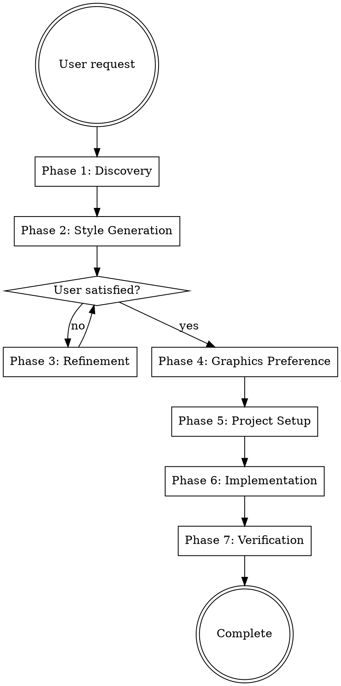

# Web Design Wizard

Interactive workflow for discovering design styles and implementing them in parallel React + Vite projects.

## Overview

Guide users through design discovery, generate multiple style options using ui-ux-pro-max, allow iterative refinement, then implement selected designs in parallel git worktrees with automated verification.

## When to Use

Use this skill when:
- User wants to explore different design styles for a web page
- User asks for design options or suggestions
- User wants to compare multiple visual approaches
- User needs several design implementations to choose from
- User says "show me design styles/options" or similar

Do NOT use when:
- User has specific design already defined (use frontend-design directly)
- User wants to modify existing design (not create new ones)
- Project is not React-based

## Workflow



## Phase 1: Discovery

Ask user about their web page using AskUserQuestion tool with multiple choice:

1. **Project name detection**:
   - Read package.json or git repo name
   - Show detected name: "I detected '[ProjectName]' - is this correct?"
   - Allow override if needed

2. **Web page type**:
   - Landing page, Portfolio, Blog, E-commerce, SaaS, Documentation, etc.

3. **Target audience**:
   - Professionals, Consumers, Developers, Creative industry, etc.

4. **Desired mood/feeling**:
   - Professional, Playful, Luxury, Minimal, Bold, Warm, Futuristic, etc.

5. **Content language**:
   - English, Danish, Spanish, French, German, etc.
   - Ask: "What language should the website content be in?"

6. **Style preferences/anti-preferences**:
   - Open-ended or multiple choice based on responses

**State tracking:** Keep notes on all responses for style generation keywords.

## Phase 2: Style Generation

Generate design styles using ui-ux-pro-max:

**Default count:** 4 styles (user can request different number: "show me 6 options")

**For each style:**

1. **Craft diverse keywords** based on discovery responses
   - Combine: page type + audience + mood + unique aesthetic
   - Ensure diversity across all styles
   - Examples:
     - "luxury minimalist portfolio clean geometric premium"
     - "playful organic warm craft natural wellness"
     - "futuristic glassmorphism dark neon tech cyber"

2. **Generate design system**:
   ```bash
   python3 ~/.claude/skills/ui-ux-pro-max/scripts/search.py "[keywords]" \
     --design-system --persist -p "[ProjectName]" --page "[style-name]"
   ```

   Saves to: `design-system/pages/[style-name].md` in main repo

3. **Present to user** with:
   - Style name (e.g., "Luxury Minimalist", "Playful Organic")
   - Key characteristics: colors, typography, mood, effects
   - Best suited for: audience/use case
   - Visual reference description

**Presentation format:**
```
Style 1: [Name]
━━━━━━━━━━━━━━━━
Colors: [palette description]
Typography: [font families and sizing]
Mood: [3-4 adjectives]
Best for: [specific use cases]

Style 2: [Name]
━━━━━━━━━━━━━━━━
...
```

**Track generated styles:** Keep list of all style names and keywords to avoid duplicates.

## Phase 3: Refinement (Iterative)

Listen for user feedback and respond accordingly:

| User Says | Action |
|-----------|--------|
| "Give me 4 completely different styles" | Generate 4 NEW styles with different keywords |
| "Give me 4 more options" | Generate 4 NEW styles (avoid previous keywords) |
| "I like 1 and 3, give me 2 more like style 3" | Keep styles 1 & 3, generate 2 variations of style 3 |
| "Combine styles 1 and 3" | Generate 1 new style blending those aesthetics |
| "I like 1, 2, and 4 - let's implement" | Move to Phase 4 with those 3 styles |
| "Implement all of them" | Move to Phase 4 with all generated styles |

**Avoid duplicates:** Check tracked styles list before generating new ones.

## Phase 4: Graphics Preference

**BEFORE implementing**, ask about graphics for EACH selected style:

Use AskUserQuestion with options per style:
- "Lots of graphics (hero image + accent graphics + illustrations)"
- "Minimal graphics (hero image only)"
- "You decide based on design style"

**Track preference per style** for implementation phase.

## Phase 5: Project Setup

**BEFORE spawning implementation agents**, create the project structure in the repo root:

### Step 1: Confirm Project Location

**Suggested location:** `designs/[project-name]/`

**Ask user for confirmation:**
```
I suggest creating the project at:
  designs/[project-name]/

This will serve as the root for implementing and previewing the [N] design styles.

Is this location correct, or would you like to modify it?
```

Use AskUserQuestion with options:
- "Yes, use designs/[project-name]/" (Recommended)
- "Use a different directory (specify in chat)"

If user specifies custom location, use that instead.

### Step 2: Create Project Directory

```bash
mkdir -p [confirmed-location]
cd [confirmed-location]
```

### Step 3: Write concept.md

Create a business concept document capturing the purpose and vision:

```markdown
# [ProjectName] - Business Concept

**Created:** [Date]
**Content Language:** [English/Danish/etc.]

---

## Business Overview

**Type:** [Landing page/Portfolio/Blog/E-commerce/SaaS/etc.]

**Purpose:** [1-2 sentence description of what this business/project does]

**Target Audience:** [Professionals/Consumers/Developers/Creative industry/etc.]

**Value Proposition:** [What unique value does this offer to the target audience?]

---

## Brand & Voice

**Mood/Feeling:** [Professional/Playful/Luxury/Minimal/Bold/Warm/Futuristic/etc.]

**Tone of Voice:** [How should the brand communicate? Formal, casual, technical, friendly, etc.]

**Key Messages:**
- [Primary message 1]
- [Primary message 2]
- [Primary message 3]

---

## Design Direction

**Desired Aesthetics:**
- [Aesthetic preference 1]
- [Aesthetic preference 2]

**Anti-Patterns (What to Avoid):**
- [What styles/approaches should NOT be used]

---

## Content Strategy

**Primary Content Sections:**
1. [Section 1 - e.g., Hero/Introduction]
2. [Section 2 - e.g., Features/Benefits]
3. [Section 3 - e.g., Testimonials/Social Proof]
4. [Section 4 - e.g., Call to Action]

**Key Features/Offerings:**
- [Feature 1]
- [Feature 2]
- [Feature 3]

---

## Success Criteria

**User Actions We Want:**
- [Action 1 - e.g., Sign up for newsletter]
- [Action 2 - e.g., Request demo]
- [Action 3 - e.g., Make purchase]

**Metrics That Matter:**
- [Metric 1 - e.g., Conversion rate]
- [Metric 2 - e.g., Time on page]
- [Metric 3 - e.g., Click-through rate]

---

## Competitive Context

**Similar Sites/Products:**
- [Competitor 1] - [What we like/dislike]
- [Competitor 2] - [What we like/dislike]

**Differentiation:**
[How is this different from competitors?]

---

## Technical Requirements

**Must-Have Features:**
- [Required feature 1]
- [Required feature 2]

**Nice-to-Have Features:**
- [Optional feature 1]
- [Optional feature 2]

**Integrations Needed:**
- [Integration 1 - e.g., Analytics]
- [Integration 2 - e.g., Email service]

---

*This concept document guides all design and implementation decisions.*
```

**Populate this document based on all discovery phase responses.**

---

### Step 4: Write README.md

Create comprehensive README documenting the design exploration:

```markdown
# [ProjectName] - Design Style Exploration

**Purpose:** This directory serves as the root for implementing and previewing multiple design styles for [ProjectName].

**Content Language:** [English/Danish/etc.]

**Project Type:** [Landing page/Portfolio/Blog/etc.]

**Target Audience:** [Professionals/Consumers/etc.]

**Created:** [Date]

---

## Design Styles

We're exploring [N] distinct design styles to find the best visual approach:

### 1. [Style 1 Name]
**Keywords:** [keywords used for generation]
**Mood:** [adjectives]
**Colors:** [palette description]
**Typography:** [font families]
**Graphics:** [lots/minimal/adaptive]
**Best for:** [use cases]

**Implementation:** `.worktrees/[style-1-branch]/`
**Design System:** `../../design-system/pages/[style-1].md`

---

### 2. [Style 2 Name]
...

---

## Structure

```
designs/[project-name]/
├── README.md                          # This file
├── concept.md                         # Business concept and strategy
└── (git repository root)

.worktrees/                            # In main repo root
├── [style-1-branch]/                  # Style 1 implementation
│   ├── src/
│   ├── package.json
│   └── ...
├── [style-2-branch]/                  # Style 2 implementation
└── ...

design-system/pages/                   # In main repo root
├── [style-1].md                       # Style 1 specification
├── [style-2].md                       # Style 2 specification
└── ...
```

## Preview

Each design style can be previewed by:

1. Navigate to worktree: `cd ../../.worktrees/[style-branch]/`
2. Start dev server: `npm run dev`
3. Open browser: `http://localhost:5173`

## Production Builds

Build any style for production:

```bash
cd ../../.worktrees/[style-branch]/
npm run build
```

Built files will be in `dist/` directory.

---

## Next Steps

After reviewing all implementations:
1. Compare verification reports
2. Select preferred style(s)
3. Merge chosen design to main branch
4. Deploy to production

---

*Generated by Web Design Wizard*
```

### Step 5: Git Initialize

```bash
git init
git add README.md concept.md
git commit -m "docs: initialize [project-name] design exploration

Setup directory structure for exploring [N] design styles.

Design styles:
- [Style 1 Name]
- [Style 2 Name]
- ...

Co-Authored-By: Claude Sonnet 4.5 <noreply@anthropic.com>"
```

**Output to user:**
```
✅ Project setup complete: designs/[project-name]/
   - concept.md created (business concept and strategy)
   - README.md created (design exploration documentation)
   - Git repository initialized
   - Initial commit made

Ready to implement [N] design styles in parallel.
```

---

## Phase 6: Parallel Implementation

**CRITICAL: Execute all implementation agents in SINGLE message with multiple Task tool calls.**

**For each selected style, spawn one sub-agent with this prompt:**

```
Implement the [StyleName] design for [ProjectName].

Context:
- Design specification: design-system/pages/[style-name].md
- Graphics preference: [lots/minimal/you-decide]
- Project type: React + Vite
- Create new project from scratch

Required steps:

1. Load superpowers:using-git-worktrees
   → Create worktree: .worktrees/[style-name-branch]/

2. Create new React + Vite project in worktree
   → Use: npm create vite@latest . -- --template react
   → Install dependencies: npm install

3. Read design specification
   → File: design-system/pages/[style-name].md (in main repo)

4. Load frontend-design:frontend-design
   → Implement design system into src/App.jsx
   → Apply production-grade polish per frontend-design guidelines

5. Load vercel-react-best-practices
   → Apply React performance best practices
   → Optimize bundle size and rendering

6. Load copywriting
   → Refine all copy to match design tone/voice
   → Ensure copy complements visual style

7. Load nanobanana
   → Generate images based on graphics preference:
     - Lots: Hero (16:9) + 2-3 accent graphics (4:3, 1:1)
     - Minimal: Hero image only (16:9)
     - You decide: Based on design style needs
   → Use prompts from design specification
   → Save to src/assets/[style-name]-*.png

8. Implement complete design
   → Apply all design system specifications
   → Ensure responsive design
   → Add proper image integration

9. Build production bundle
   → Run: npm run build
   → Verify build succeeds

10. Commit changes
    → Message: "feat: [style-name] design implementation"
    → Include: all source files + images + design-system reference

Important:
- Do NOT load ui-ux-pro-max in this agent
- The design-system file contains all necessary specifications
- Focus on implementation, not spec regeneration
```

**Wait for all implementation agents to complete before Phase 7.**

---

## Phase 7: Parallel Verification

**CRITICAL: Execute all verification agents in SINGLE message with multiple Task tool calls.**

**For each implemented design, spawn one verification sub-agent with this prompt:**

```
Verify the [StyleName] implementation for [ProjectName].

Location: .worktrees/[style-name-branch]/

Verification checklist:

1. Start dev server
   → Run: npm run dev
   → Verify server starts without errors

2. Validate all URLs
   → Read src/App.jsx and extract all href/src attributes
   → Check each URL/path:
     - Internal links exist and are valid
     - External links return 200 status
     - Image paths resolve correctly
   → Report any broken links with specific URLs

3. Validate graphics implementation
   → Check all images exist in src/assets/
   → Verify images are:
     - Properly referenced in code
     - Correct aspect ratios per design spec
     - Visually appropriate for design style
   → Check if graphics preference was followed:
     - Lots: Hero + 2-3 accents present
     - Minimal: Hero only
     - You decide: Matches style needs
   → Screenshot homepage to verify visual rendering

4. Design specification adherence
   → Read design-system/pages/[style-name].md
   → Verify implementation matches:
     - Color palette
     - Typography (fonts, sizes)
     - Layout structure
     - Effects (shadows, borders, animations)
   → Score each category (1-10)

5. Build verification
   → Run: npm run build
   → Verify build completes successfully
   → Check bundle size is reasonable

6. Generate report
   → Format:
     [StyleName] Verification Report
     ━━━━━━━━━━━━━━━━━━━━━━━━━━━
     ✅/❌ Dev server: [status]
     ✅/❌ URLs: [X/Y valid] [list broken URLs]
     ✅/❌ Graphics: [X/Y present] [issues if any]
     ✅/❌ Design adherence: [avg score]/10
     ✅/❌ Production build: [status]

     Issues found: [list or "None"]
     Recommendations: [if any]

Output the report for user review.
```

**Aggregate results:** After all verifications complete, show comparison:

```
Verification Summary
━━━━━━━━━━━━━━━━━━━━━━━━━━━━━━━━━━

Style 1: [Name]
✅ All checks passed
Design score: 8.5/10

Style 2: [Name]
⚠️ 2 broken URLs found
Design score: 9.0/10

Style 3: [Name]
❌ Build failed
See report for details

Recommendation: [Best performing style] recommended based on verification results.
```

## State Tracking

Maintain throughout conversation:

```javascript
{
  projectName: "detected-name",
  pageType: "landing-page",
  audience: "professionals",
  mood: "minimal-luxury",
  contentLanguage: "English",
  generatedStyles: [
    { name: "luxury-minimal", keywords: "...", selected: true, graphics: "lots" },
    { name: "warm-organic", keywords: "...", selected: false },
    // ...
  ],
  projectSetupComplete: false,
  currentPhase: "discovery"
}
```

## Common Patterns

**User wants more variety:**
```
User: "These are too similar"
→ Generate with MORE diverse keywords
→ Different color families, typography styles, layout patterns
```

**User wants refinement:**
```
User: "I like the colors of 1 but the layout of 3"
→ Generate new style combining those specific attributes
→ Keywords: "[style-1-color-keywords] + [style-3-layout-keywords]"
```

**User wants specific count:**
```
User: "Show me 8 options"
→ Generate 8 styles (not default 4)
→ Ensure all 8 are diverse
```

## Error Handling

| Error | Recovery |
|-------|----------|
| ui-ux-pro-max fails | Retry with simpler keywords, or manual design system creation |
| All styles rejected | Ask for specific direction, then generate targeted styles |
| Implementation fails | Check error, fix in worktree, re-run build |
| Verification fails | Report issues, user decides to fix or discard |
| Graphics generation fails | Continue without images, note in verification |

## Quality Checklist

Before presenting styles to user:
- [ ] All 4+ styles are visually distinct
- [ ] Keywords match user's discovery responses
- [ ] Each style has clear use case
- [ ] Design system files created successfully

Before implementation:
- [ ] Graphics preference recorded for each style
- [ ] Project name confirmed
- [ ] Content language confirmed
- [ ] User has selected specific styles
- [ ] Project directory created: designs/[project-name]/
- [ ] concept.md written (business concept and strategy)
- [ ] README.md written (design exploration documentation)
- [ ] Git repository initialized and committed

After implementation:
- [ ] All sub-agents completed
- [ ] Production builds succeed
- [ ] Verification reports generated

## Examples

**Example 1: Portfolio exploration**
```
User: "I want to see design options for my portfolio"

Phase 1 - Discovery:
→ Detected project: "john-portfolio"
→ Page type: Portfolio
→ Audience: Creative professionals
→ Mood: Bold and distinctive
→ Content language: English

Phase 2 - Generation:
→ Generate 4 styles:
  1. Brutalist Bold
  2. Liquid Glass Premium
  3. Retro Futurism
  4. Swiss Modernism

User: "I like 1 and 3, give me 2 more like style 1"

Phase 3 - Refinement:
→ Keep styles 1 & 3
→ Generate 2 brutalist variations:
  5. Neo-Brutalist Colorful
  6. Brutalist Minimal

User: "Implement 1, 3, and 5"

Phase 4 - Graphics:
→ Ask preference for each:
  Style 1: "Lots of graphics"
  Style 3: "You decide"
  Style 5: "Minimal graphics"

Phase 5 - Project Setup:
→ Confirm location: designs/john-portfolio/
→ Create directory
→ Write concept.md (business concept and strategy)
→ Write README.md (style documentation)
→ Git init + commit

Phase 6 - Implementation:
→ Spawn 3 parallel agents
→ Create 3 worktrees
→ Implement designs

Phase 7 - Verification:
→ Spawn 3 verification agents
→ Check URLs, graphics, design adherence
→ Generate reports
→ Show comparison
```

## Technical Details

**Project structure:**
```
[repo-root]/
├── designs/
│   └── [project-name]/
│       ├── concept.md          # Business concept and strategy
│       ├── README.md           # Design exploration documentation
│       └── .git/               # Git repository for project docs
├── design-system/
│   └── pages/
│       ├── [style-1].md        # Style 1 specification
│       ├── [style-2].md        # Style 2 specification
│       └── ...
└── .worktrees/
    ├── [style-1-branch]/       # Style 1 implementation
    │   ├── src/
    │   │   ├── App.jsx
    │   │   └── assets/
    │   ├── package.json
    │   └── ...
    ├── [style-2-branch]/       # Style 2 implementation
    └── ...
```

**Key locations:**
- **Project docs**: `designs/[project-name]/` (git initialized)
- **Design specs**: `design-system/pages/[style].md` (in main repo)
- **Implementations**: `.worktrees/[style-branch]/` (separate worktrees)

**Skills loaded in implementation sub-agents:**
1. superpowers:using-git-worktrees
2. frontend-design:frontend-design
3. vercel-react-best-practices
4. copywriting
5. nanobanana

**NOT loaded:** ui-ux-pro-max (already generated specs)

## Success Criteria

User receives:
- Multiple distinct design options matching their requirements
- Ability to refine and iterate on styles
- Fully implemented React projects for each selected style
- Verified implementations with quality reports
- Clear recommendation based on verification results
