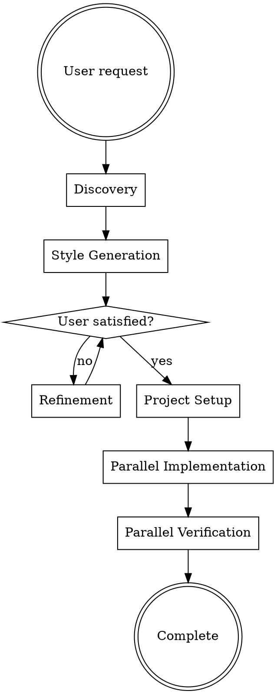

> ⚠️ **Spelling:** It's `saurun:` (with U), not "sauron"

# Web Design Wizard

Generate multiple distinct design styles for a web page, let the user refine selections, then implement chosen designs in parallel worktrees.

## When to Use

- User wants to explore different design styles for a web page
- User asks for design options, visual direction, or style comparison
- User wants multiple implementations to choose from

**Do NOT use when:**
- User has a specific design already defined → use `saurun:react-tailwind-v4-components` or `frontend-design` directly
- User wants to modify an existing design, not create new ones

## Workflow



## Phase 1: Discovery

Use AskUserQuestion to gather context. **Batch questions** — use up to 4 questions per call. **Infer obvious answers** from context (e.g., a coffee shop is consumer-facing, probably warm mood).

Gather:
1. **Project name** — detect from package.json or git repo name, confirm with user
2. **Page type** — Landing, Portfolio, Blog, E-commerce, SaaS, Documentation
3. **Target audience** — Professionals, Consumers, Developers, Creative industry
4. **Mood/feeling** — Professional, Playful, Luxury, Minimal, Bold, Warm, Futuristic
5. **Content language** — English, Danish, etc.
6. **Style preferences/anti-preferences** — only if not obvious from above

Skip questions where the answer is obvious from the user's request.

## Phase 2: Style Generation

Generate design styles using `ui-ux-pro-max`:

**Default:** 4 styles (user can request different count).

For each style:

1. **Craft diverse keywords** from discovery responses. Combine: page type + audience + mood + unique aesthetic. Ensure variety across all styles.

2. **Generate design system:**
   ```bash
   python3 ~/.claude/skills/ui-ux-pro-max/scripts/search.py "[keywords]" \
     --design-system --persist -p "[ProjectName]" --page "[style-name]"
   ```
   Saves to: `design-system/pages/[style-name].md` in current working directory.

3. **Present to user** with: style name, key colors, typography, mood adjectives, and best use case.

**Track generated styles** to avoid duplicate keywords in refinement rounds.

## Phase 3: Refinement (Iterative)

| User Says | Action |
|-----------|--------|
| "Give me N completely different styles" | Generate N NEW styles with different keywords |
| "Give me N more options" | Generate N NEW (avoid previous keywords) |
| "I like X and Y, give me more like X" | Keep X & Y, generate variations of X |
| "Combine styles X and Y" | Generate 1 new blending those aesthetics |
| "Implement X, Y, Z" or "Implement all" | Move to Phase 4 with selections |

## Phase 4: Graphics Preference

**Before implementation**, ask about graphics for all selected styles at once:

Use AskUserQuestion with options:
- "Lots of graphics for all (hero + accent graphics + illustrations)"
- "Minimal graphics for all (hero image only)"
- "Let the design style determine graphics" (Recommended)
- "I want to choose per style"

Only ask per-style if user picks the last option.

## Phase 5: Project Setup

### Confirm project location

**Suggested:** `designs/[project-name]/` in current working directory.

Ask user to confirm or override.

### Create project

1. `mkdir -p [location]`
2. Write `concept.md` — see [concept-template.md](concept-template.md) for template. Populate from discovery responses. **Only fill fields you have data for — omit sections with no info.**
3. Write `README.md` — include: project name, styles being explored (name + keywords + mood), directory layout, and how to preview each style (`cd .worktrees/[style]/ && npm run dev`). Keep it brief.
4. **Do NOT run `git init`** — use the existing repo. Commit project docs to the current branch.

```bash
git add designs/[project-name]/
git commit -m "docs: initialize [project-name] design exploration"
```

### Project structure

```
[repo-root]/
├── designs/[project-name]/
│   ├── concept.md
│   └── README.md
├── design-system/pages/
│   ├── [style-1].md
│   └── [style-2].md
└── .worktrees/
    ├── [style-1-branch]/    # React + Vite project
    └── [style-2-branch]/
```

## Phase 6: Parallel Implementation

**CRITICAL: Spawn ALL implementation agents in a SINGLE message with multiple Task tool calls.**

For each selected style, spawn one sub-agent. See [implementation-prompt.md](implementation-prompt.md) for the full prompt template. **Replace `[absolute-path-to-repo-root]`** with the actual repo root path so sub-agents can resolve cross-worktree references.

Key points for each sub-agent:
- Use `superpowers:using-git-worktrees` to create worktree at `.worktrees/[style-name]/`
- Create React + Vite project: `npm create vite@latest . -- --template react`
- Read design spec from `design-system/pages/[style-name].md`
- Use `Skill` tool to invoke: `frontend-design`, `vercel-react-best-practices`, `copywriting`, `nano-banana-pro`
- Generate images per graphics preference
- Build with `npm run build` to verify
- Commit all changes

**Wait for ALL agents to complete before Phase 7.**

## Phase 7: Parallel Verification

**CRITICAL: Spawn ALL verification agents in a SINGLE message with multiple Task tool calls.**

For each implementation, spawn one verification sub-agent. See [verification-prompt.md](verification-prompt.md) for the full prompt template. **Assign ports sequentially** (5173, 5174, 5175, ...) and **replace `[absolute-path-to-repo-root]`** with the actual path.

Verification checks:
- Dev server starts without errors
- All URLs/links are valid
- Images exist and are properly referenced
- Design spec adherence (color, typography, layout, effects) — score 1-10
- Production build succeeds

**After all complete**, show comparison summary:

```
Style 1: [Name] — ✅ All passed — Design: 8.5/10
Style 2: [Name] — ⚠️ 2 broken URLs — Design: 9.0/10
Style 3: [Name] — ❌ Build failed — See report
```

Recommend best-performing style based on results.

## Error Handling

| Error | Recovery |
|-------|----------|
| `ui-ux-pro-max` script fails | Retry with simpler keywords. If persistent, create design system manually from the style keywords. |
| All styles rejected | Ask user for specific direction: "What did you dislike? Colors? Layout? Overall feel?" |
| Sub-agent skill not found | The agent should use `Skill` tool to invoke. If skill genuinely missing, skip that enhancement step and note it. |
| Implementation build fails | Fix in worktree, re-run build. Report issue if unfixable. |
